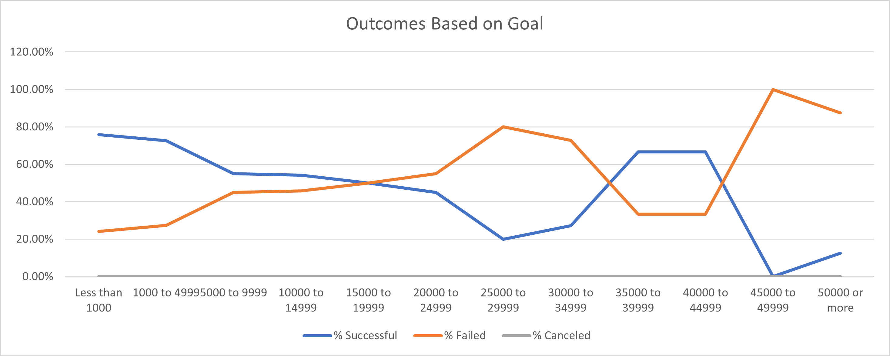

# An Analysis of Kickstarter Campaigns
### Performing analysis on Kickstarter data to uncover trends

## Overview/Purpose
  I've compiled an analysis of data with appropriate graphics in order to compare how different kickstarter campaigns succeeded (or failed) in relation to their launch dates and funding goals. 
  
## Analysis & Challenges
### Theater Outcomes Based on Launch Date Analysis
  In order to determine which month would be most likely to have a successful campaign launch, I compared the number of canceled, failed, and successful theater launches by month, regardless of year. The best visualization for this pivoted data was a line chart, see below. 
  This data firstly tells us that the number of successful campaigns launched was always greater than the number of failed campaigns for that same month. The data also indicates that the highest number of both successful and failed theater campaigns were launched in May. The number of canceled campaigns remains very small year-round with a slight peak in January and dips every 3 months afterwards. The distance between the lines for successful and failed campaigns is greatest in three months, May, June and July. Inference can be made based on these results that the best time of year to start a theater campaign is late spring/early summer months. We can speculate on the many reasons this would be true, for example; recovery from excessive holiday spending has already occurred so people are ready to donate towards kickstarter campaigns again, or the increasingly fair weather reminds people to spend time socializing outside of their homes and contributing to a theater production would be a great way to do this. 

### Play Outcomes Based on Funding Goal Amount Analysis
  In order to visualize any possible correlation of funding goal amount and percentage of success, I quickly and accurately collected data using a CountIfs() Function. 
  I was then able to easily populate the percentages using the total counts for each range using simple Sum() formulas and calculations. To visualize this data I utilized a line chart with the percentages on the vertical (y-) axis, and the goal-amount ranges on the horizontal (x-) axis.  The orange line represents the percentage of failed outcomes, while the blue line represents the percentage of successful outcomes. The grey line (on the x-axis) represents the percentage cancelled, which is zero. There were no canceled kickstarters in the play subcategory. This means that the successful and failed outcomes are directly inverse of one another and total up to 100% for each goal-amount range. The least successful ranges are 25,000-29,999 and 45,000-49,999 as indicated by the dip in the blue successful line. The points at which the lines cross, at three different ranges: 15,000-19,999, and around 35,000 and 45,000 indicates that the outcome is equally likely to fail as it is to succeed, making it a risky goal to set. 
  
### Challenges Overcome
  During the data gathering for theater outcomes based on launch date the first challenge would've been creating a 'Year' column utilizing a new excel formula. The second challenge could've occurred when selecting the rows, columns, values and outcome categories for the pivot table. Grouping/Ungrouping the Year by Quarters and then Months was new for me. I know a classmate who struggled with removing the 'Live' outcome, not realizing he could use the filter option within the Pivot table to remove the unwanted column. Ensuring to filter the parent category to show only data for the theater type was also a crucial step that if missed would've caused very inaccurate data. Sorting the campaign outcomes in descending order might've also been difficult for some people. The line chart didnt originally come with labels, or titles, so adding those might have been another easily overlooked step that is important to explain and give reference to the chart. 
  Gathering the data for the play outcomes based on funding goal amount was an entirely new excel function for me. I was about to use what we'd discussed in class in regards to the 'if' and 'else' functions to assist on this particular challenge. I needed to conceptualize the information being asked before I tried to write the formulas, starting with the smallest and then the largest goal amount ranges was easiest for me. For all the mid-ranges I knew I needed to include the last criteria to 'cap' the goal amount range to stay within those two values indicated in column A. I copied the formulas across to columns for Failed and Canceled, changing the specific words to ensure I was pulling the correct data from the kickstarter sheet for each column. Creating the line graph was relatively easy though I could see how updating the labels on the x-axis might've been a little difficult for some to pull in that data from Column A. 
  
## Results
### Theater Outcomes Based on Launch Date Results 
 Its strongly suggestible that starting a theater campaign in May, June or July would yield the highest success probability. If the only concern was prevention of cancelation of the kickstarter, the most favorable month to start a campaign would be October, as there were zero recorded cancelations within that month.
 
### Play Outcomes Based on Funding Goal Amount Results
  The ideal goal-range with the highest percentage of successful campaigns was less than 1,000, at just over 75%. This would indicate the plays that required less funding (lower goal amounts) are the most likely to succeed. 

###Suggestions and Summary
  The line graph was useful on the first data set to track any trends that might occur over the course of a year/months to see if a particular time of year was more favorable to launch a theater campaign. The main concern was that we grouped multiple years of data together without looking at them individually first to observe any possible outliers or years that didn't fit with the overall analysis. Generalizing by monthly success across multiple years without taking averages first allows for a possible misrepresentation of success vs. failure rates. 
  The line graph was redundant in representing the data for play outcome percentages. There were no cancelations, and the percentages add up to 100%. The lines were mirror images of each other, and didn't really tell us anything significant. I believe the data is much better visualized using a stacked bar graph like this one.  Overall, the data set spanned less than 10 years and averages weren't taken for many of these charted statistics. I cannot say with any measurable confidence that the values are representative of the overall population vs. just this sample subset. 
  
